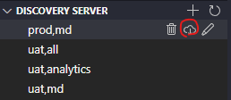

## Prerequisite

- vscode 1.75+
- tmux 3.0+
- kdb+/q 3.5+
- go 1.19.7+

## vscode Configuration

install plugin

- vscode-q 3.1.4+
- Dracula Official
- Prettier
- Go

`ctrl+shift+p`, search for `Preference: Open User Settings (JSON)`, add the following settings

```JSON
{
    "files.trimTrailingWhitespace": true,
    "editor.tokenColorCustomizations": {
        "textMateRules": [
            {
                "scope": "comment.line.attention",
                "settings": {
                    "fontStyle": "italic",
                    "foreground": "#B71C1C"
                }
            },
            {
                "scope": "comment.line.todo",
                "settings": {
                    "fontStyle": "italic",
                    "foreground": "#2E7D32"
                }
            }
        ]
    },
    "workbench.colorTheme": "Dracula Soft",
    "output.smartScroll.enabled": false,
    "files.trimFinalNewlines": true
}
```

## Play with Discovery Server

1. copy discovery server conf file

```bash
bash cpDiscoveryServerConf.sh
```

2. reload DISCOVERY SERVER


3. start discovery server and kdb processes

```bash
bash discovery.sh
```

4. download kdb processes from discovery server


